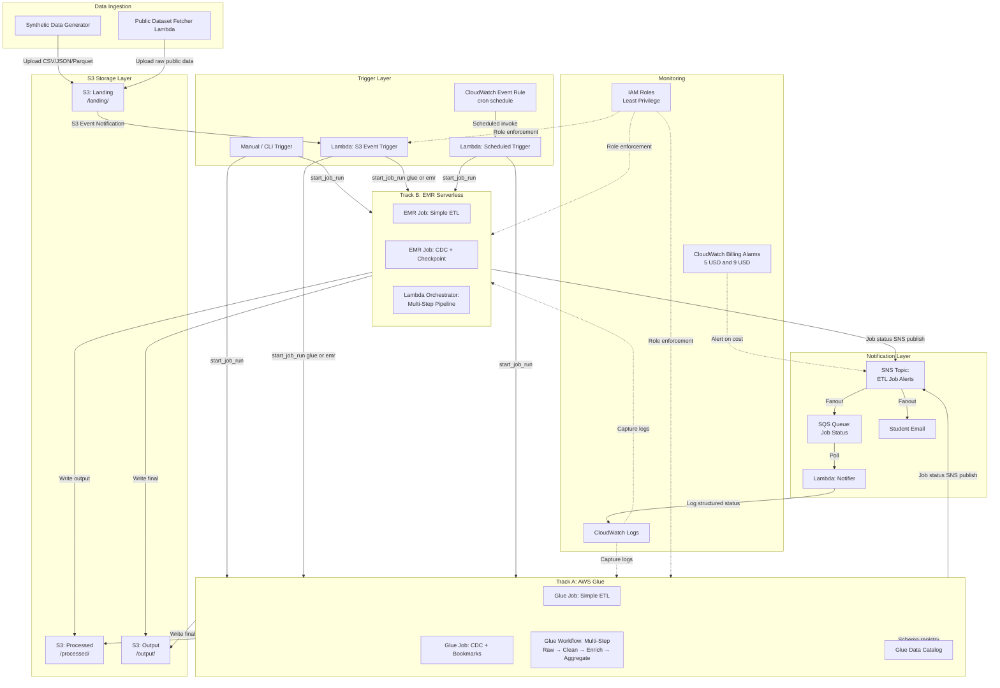
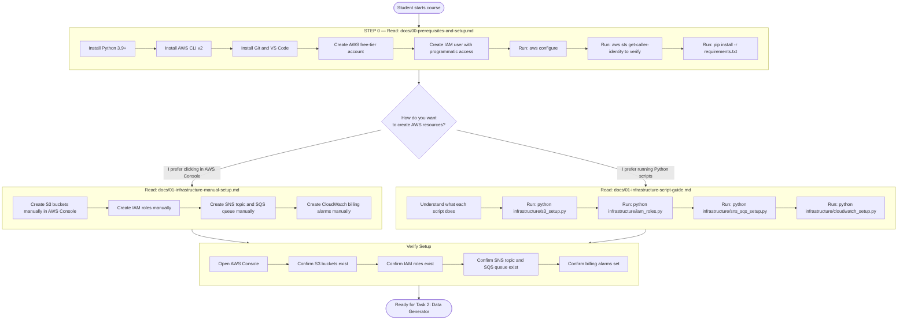
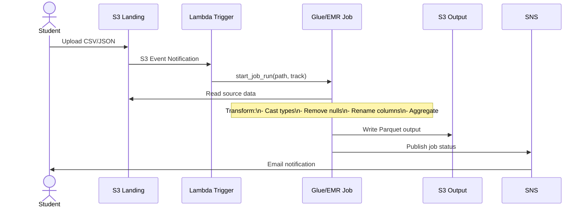
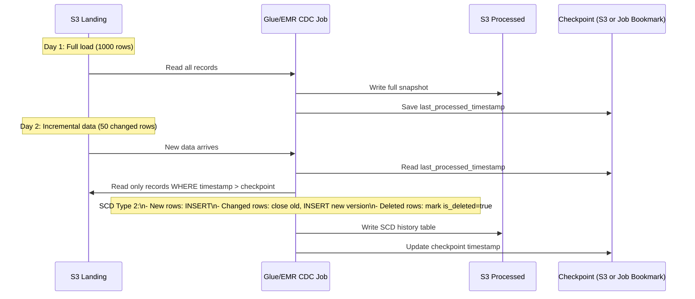

# High-Level Architecture

The project is organized into layers: data ingestion, storage, processing (dual-track), orchestration, and notification.
Design - Batch Process ETL Teaching Project

## 1. 


---

## 2. Student Onboarding Flow

Students who are new to AWS must follow this sequence before touching any code. The flow below shows the order of steps and which instruction file covers each one.



### 2.1 Instruction File Design Principles

Every `docs/` instruction file follows the same structure so students always know what to expect:

```
# Task N — [Task Name]

## What Are We Building?
Plain English explanation of what this task does and why it matters.

## Concepts Explained
Short explanation of each AWS service or concept used (e.g., "What is S3?",
"What is a Lambda function?"). Suitable for students with no AWS background.

## Prerequisites
Checklist of what must be done before starting this task.

## Option A: Manual Setup (AWS Console)
Step-by-step screenshots-friendly instructions for creating resources
by hand in the AWS Console. Every click is described.

## Option B: Script Setup (Python)
How to run the Python scripts for this task:
- What the script does (explained in plain English)
- The exact command to run
- What output to expect
- How to verify it worked

## Verification Steps
How to confirm everything is working before moving to the next task.

## What Did We Just Build?
Summary of what was created, with a diagram if helpful.

## Common Errors and Fixes
Table of errors students commonly hit and how to resolve them.

## Cost Impact
Estimated cost impact of this task and how to minimize it.

## Next Step
Link to the next instruction file.
```

---

## 3. Data Flow

### 2.1 Simple ETL Flow



### 2.2 CDC Flow



### 2.3 Multi-Step Pipeline Flow

```mermaid
flowchart LR
    S3L[("S3 Landing\nraw CSV")] -->|Stage 1| RAW

    subgraph RAW["Step 1: Raw"]
        R1[Load file]
        R2[Schema check]
        R3[Write raw Parquet]
    end

    RAW -->|Pass| CLEAN

    subgraph CLEAN["Step 2: Clean"]
        C1[Remove nulls]
        C2[Fix data types]
        C3[Standardize formats]
        C4[Write clean Parquet]
    end

    CLEAN -->|Pass| ENRICH

    subgraph ENRICH["Step 3: Enrich"]
        E1[Join reference data]
        E2[Add calculated columns]
        E3[Write enriched Parquet]
    end

    ENRICH -->|Pass| AGGREGATE

    subgraph AGGREGATE["Step 4: Aggregate"]
        A1[Group by dimensions]
        A2[Calculate KPIs]
        A3[Write summary Parquet]
    end

    AGGREGATE --> S3O[("S3 Output\nsummary Parquet")]

    RAW -->|Fail| NOTIFY[SNS Alert]
    CLEAN -->|Fail| NOTIFY
    ENRICH -->|Fail| NOTIFY
    AGGREGATE -->|Fail| NOTIFY
```



---

## 4. Project Folder Structure

```
batch-etl-teaching-project/
│
├── .kiro/
│   └── specs/
│       └── batch-etl-teaching-project/
│           ├── requirements.md
│           ├── design.md
│           └── tasks.md
│
├── infrastructure/
│   ├── s3_setup.py               # Create S3 buckets + lifecycle policies
│   ├── iam_roles.py              # Create IAM roles for Glue, EMR, Lambda
│   ├── sns_sqs_setup.py          # Create SNS topic + SQS queue + subscription
│   └── cloudwatch_setup.py       # Billing alarms, log groups, CloudWatch rule
│
├── data-generator/
│   ├── generate_sales.py         # Sales CSV: order_id, product, qty, price, ts
│   ├── generate_users.py         # Users JSON: user_id, name, email, country
│   ├── generate_transactions.py  # Transactions Parquet: txn_id, amount, status
│   ├── generate_cdc_data.py      # Incremental data with operation=INSERT/UPDATE/DELETE
│   └── upload_to_s3.py           # Upload generated data to S3 landing bucket
│
├── glue-jobs/
│   ├── simple-etl/
│   │   └── glue_simple_etl.py    # Glue DynamicFrame ETL
│   ├── cdc/
│   │   └── glue_cdc_job.py       # Glue CDC with job bookmarks + SCD Type 2
│   └── multi-step/
│       ├── glue_step1_raw.py
│       ├── glue_step2_clean.py
│       ├── glue_step3_enrich.py
│       └── glue_step4_aggregate.py
│
├── emr-jobs/
│   ├── simple-etl/
│   │   └── emr_simple_etl.py     # PySpark DataFrame ETL
│   ├── cdc/
│   │   └── emr_cdc_job.py        # PySpark CDC with S3 checkpoint + SCD Type 2
│   └── multi-step/
│       ├── emr_step1_raw.py
│       ├── emr_step2_clean.py
│       ├── emr_step3_enrich.py
│       └── emr_step4_aggregate.py
│
├── lambda-functions/
│   ├── s3_event_trigger/
│   │   └── handler.py            # S3 event -> start Glue or EMR job
│   ├── scheduled_trigger/
│   │   └── handler.py            # CloudWatch schedule -> start job
│   ├── notifier/
│   │   └── handler.py            # SQS consumer -> log structured job status
│   └── public_data_fetcher/
│       └── handler.py            # Fetch public CSV from URL -> upload to S3
│
├── public-datasets/
│   └── fetch_nyc_taxi.py         # Download NYC Taxi data to S3 landing
│
├── tests/
│   ├── test_data_generator.py    # Unit tests for data generators
│   ├── test_glue_transformations.py  # Unit tests for Glue PySpark logic
│   └── test_emr_transformations.py   # Unit tests for EMR PySpark logic
│
├── requirements.txt              # All Python dependencies pinned with versions
│
└── docs/
    │
    │   ── STUDENT INSTRUCTION GUIDES (read these in order) ──────────────────
    ├── 00-prerequisites-and-setup.md       # START HERE: install Python, AWS CLI,
    │                                        # configure AWS account, cost rules
    ├── 01-infrastructure-manual-setup.md   # Step-by-step AWS Console guide to
    │                                        # create every resource by hand
    ├── 01-infrastructure-script-guide.md   # How to run the infrastructure Python
    │                                        # scripts; what each script does
    ├── 02-data-generator-guide.md          # How to run data generators; what
    │                                        # files are produced and where
    ├── 03a-glue-simple-etl-guide.md        # What AWS Glue is; register and run
    │                                        # the Simple ETL job step by step
    ├── 03b-emr-simple-etl-guide.md         # What EMR Serverless is; submit and
    │                                        # monitor the PySpark job
    ├── 04-lambda-triggers-guide.md         # How Lambda triggers work; deploy
    │                                        # and test all three trigger types
    ├── 05-scheduled-trigger-guide.md       # How CloudWatch Events work; set,
    │                                        # test, and disable schedules
    ├── 06a-glue-cdc-guide.md               # What CDC is; how Glue job bookmarks
    │                                        # work; run and verify CDC job
    ├── 06b-emr-cdc-guide.md                # S3 checkpoint-based CDC; run and
    │                                        # compare with Glue bookmarks
    ├── 07a-glue-pipeline-guide.md          # How Glue Workflows work; trigger
    │                                        # and monitor the 4-stage pipeline
    ├── 07b-emr-pipeline-guide.md           # Lambda-orchestrated EMR pipeline;
    │                                        # how to run and monitor
    ├── 08-notifications-guide.md           # How SNS/SQS work; verify email
    │                                        # alerts and queue messages
    ├── 09-public-dataset-guide.md          # Fetch real public data; run full
    │                                        # end-to-end pipeline
    ├── 10-comparison-and-cleanup.md        # Glue vs EMR summary; cost review;
    │                                        # delete all resources to stop billing
    │
    │   ── REFERENCE DOCS ────────────────────────────────────────────────────
    ├── glue_vs_emr_comparison.md           # Feature/cost/complexity matrix
    ├── cost_optimization_guide.md          # Tips to stay under $10/month
    └── student_exercises.md               # Hands-on challenges for each task
```

---

## 5. Component Design

### 4.1 AWS Glue Jobs

#### 4.1.1 Design Principles
- Use Glue DynamicFrame for schema flexibility
- Use Glue Job Bookmarks for incremental processing (CDC)
- Use Glue Data Catalog to register tables
- Use Glue Workflows for multi-step dependencies
- Use minimum DPU (2 workers G.1X) to minimize cost

#### 4.1.2 Simple ETL Script Structure

```python
# glue_simple_etl.py
import sys
from awsglue.transforms import *
from awsglue.utils import getResolvedOptions
from awsglue.context import GlueContext
from awsglue.job import Job
from pyspark.context import SparkContext

# Initialize Glue context
args = getResolvedOptions(sys.argv, ['JOB_NAME', 'source_path', 'output_path'])
sc = SparkContext()
glueContext = GlueContext(sc)
spark = glueContext.spark_session
job = Job(glueContext)
job.init(args['JOB_NAME'], args)

# Extract - Read CSV as DynamicFrame
datasource = glueContext.create_dynamic_frame.from_options(
    connection_type="s3",
    connection_options={"paths": [args['source_path']]},
    format="csv",
    format_options={"withHeader": True}
)

# Transform - Convert to DataFrame for full PySpark API access
df = datasource.toDF()
# ... transformations ...

# Load - Write Parquet output
output_df = DynamicFrame.fromDF(df, glueContext, "output")
glueContext.write_dynamic_frame.from_options(
    frame=output_df,
    connection_type="s3",
    connection_options={"path": args['output_path']},
    format="parquet"
)

job.commit()
```

### 4.2 EMR Serverless Jobs

#### 4.2.1 Design Principles
- Use native PySpark DataFrame API (no DynamicFrames)
- Use `SparkSession.builder` with S3 configurations
- Submit via `boto3 emr-serverless start_job_run`
- Package scripts as `.py` files, upload to S3 before running
- Use S3 for checkpointing instead of Glue bookmarks

#### 4.2.2 Simple ETL Script Structure

```python
# emr_simple_etl.py
import sys
from pyspark.sql import SparkSession
from pyspark.sql.functions import col, when, to_date

def main():
    spark = SparkSession.builder \
        .appName("SimpleETL") \
        .config("spark.hadoop.fs.s3.impl", "org.apache.hadoop.fs.s3a.S3AFileSystem") \
        .getOrCreate()

    source_path = sys.argv[1]
    output_path = sys.argv[2]

    # Extract
    df = spark.read.option("header", "true").csv(source_path)

    # Transform
    df_clean = df \
        .filter(col("order_id").isNotNull()) \
        .withColumn("price", col("price").cast("double")) \
        .withColumn("order_date", to_date(col("timestamp")))

    # Load
    df_clean.write.mode("overwrite").parquet(output_path)

    spark.stop()

if __name__ == "__main__":
    main()
```

### 4.3 Lambda Functions

#### 4.3.1 S3 Event Trigger

```
S3 Event (ObjectCreated)
        |
        v
Lambda: s3_event_trigger/handler.py
        |
        +--> [track == "glue"] --> glue_client.start_job_run(JobName, Arguments)
        |
        +--> [track == "emr"]  --> emr_client.start_job_run(ApplicationId, JobDriver, ...)
        |
        v
CloudWatch Logs (execution logged)
```

**Key design decisions:**
- Lambda reads S3 bucket prefix to determine which ETL pattern to run (e.g., `/landing/sales/` → simple ETL)
- Environment variables control which track (Glue or EMR) to use
- All invocations logged to CloudWatch with structured JSON

#### 4.3.2 Scheduled Trigger

```
CloudWatch Event Rule (cron)
        |
        v
Lambda: scheduled_trigger/handler.py
        |
        +--> Reads TRACK env var ("glue" or "emr")
        +--> Reads JOB_TYPE env var ("simple-etl", "cdc", "multi-step")
        |
        v
Start appropriate Glue or EMR job
```

#### 4.3.3 Notifier Lambda

```
SQS Queue (receives from SNS)
        |
        v
Lambda: notifier/handler.py
        |
        +--> Parse message: job_name, status, duration, rows_processed
        +--> Log structured JSON to CloudWatch
        +--> (Optional) Update job status in DynamoDB (future enhancement)
```

### 4.4 SNS/SQS Architecture

```
ETL Job Completion
        |
        v
SNS Topic: etl-job-notifications
        |
        +---> SQS Queue: etl-job-status-queue
        |         |
        |         v
        |     Lambda: notifier
        |         |
        |         v
        |     CloudWatch Logs
        |
        +---> Email Subscription (student@example.com)
```

**Message Format:**

```json
{
  "job_name": "glue-simple-etl",
  "track": "glue",
  "status": "SUCCEEDED",
  "start_time": "2024-01-15T10:00:00Z",
  "end_time": "2024-01-15T10:08:00Z",
  "duration_seconds": 480,
  "rows_processed": 10000,
  "output_path": "s3://my-bucket/output/sales/2024-01-15/"
}
```

### 4.5 IAM Role Design

| Role | Used By | Key Permissions |
|------|---------|-----------------|
| `BatchETL-GlueServiceRole` | AWS Glue | S3 read/write (specific buckets), Glue Catalog CRUD, CloudWatch logs |
| `BatchETL-EMRServerlessRole` | EMR Serverless | S3 read/write (specific buckets), CloudWatch logs |
| `BatchETL-LambdaTriggerRole` | Lambda Triggers | glue:StartJobRun, emr-serverless:StartJobRun, s3:GetObject, sns:Publish, CloudWatch logs |
| `BatchETL-LambdaNotifierRole` | Lambda Notifier | sqs:ReceiveMessage, sqs:DeleteMessage, CloudWatch logs |
| `BatchETL-DataFetcherRole` | Lambda Fetcher | s3:PutObject (landing bucket only), CloudWatch logs |

---

## 6. Glue vs EMR Serverless Comparison

### 5.1 Architecture Comparison

| Dimension | AWS Glue | EMR Serverless |
|-----------|----------|----------------|
| **API** | DynamicFrame + Spark DataFrame | Native Spark DataFrame |
| **Schema Handling** | Glue Data Catalog, DynamicFrame schema | Manual schema definition |
| **Incremental Processing** | Job Bookmarks (built-in) | Custom checkpoint in S3 |
| **Workflow Orchestration** | Glue Workflows + Triggers | Lambda state machine |
| **Startup Time** | ~1-2 min | ~1-2 min (cold start) |
| **Cost (small job)** | ~$0.44/DPU-hour | ~$0.052/vCPU-hour |
| **Job Submission** | `glue:StartJobRun` | `emr-serverless:StartJobRun` + Spark submit |
| **Debugging** | Glue Console, CloudWatch | EMR Console, CloudWatch |
| **Script Language** | Python / Scala | Python / Scala / R |
| **Best For** | Managed ETL, Glue Catalog | Complex Spark, more control |

### 5.2 Code Complexity Comparison

| Feature | Glue Lines (est.) | EMR Lines (est.) |
|---------|-------------------|-----------------|
| Simple ETL | ~50 lines | ~40 lines |
| CDC (bookmarks vs checkpoint) | ~80 lines | ~100 lines |
| Multi-step (workflow vs Lambda) | ~60 lines/job + console config | ~80 lines/job + Lambda orchestrator |

---

## 7. Cost Architecture

### 6.1 Monthly Cost Estimate

| Service | Free Tier Limit | Estimated Usage | Estimated Cost |
|---------|----------------|-----------------|----------------|
| S3 | 5 GB storage, 20k GET, 2k PUT | < 1 GB, < 5k requests | $0.00 |
| Lambda | 1M requests, 400k GB-s | < 10k requests | $0.00 |
| SNS | 1M publishes | < 1k publishes | $0.00 |
| SQS | 1M requests | < 1k requests | $0.00 |
| CloudWatch | 10 metrics, 5 GB logs | < limits | $0.00 |
| AWS Glue | No free tier | ~5 jobs × 10 min × 2 DPU | ~$1.50 |
| EMR Serverless | No free tier | ~5 jobs × 10 min × 4 vCPU | ~$2.00 |
| **Total** | | | **~$3.50-$5.00** |

### 6.2 Cost Optimization Strategies

1. **Use smallest compute**: Glue G.1X with 2 workers, EMR minimal vCPU
2. **Short job duration**: Design demo jobs to run in under 10 minutes
3. **Disable schedules**: Turn off CloudWatch rules when not actively learning
4. **Delete unused resources**: Remove EMR applications, Glue Dev Endpoints after demos
5. **S3 lifecycle policies**: Auto-delete landing data after 7 days
6. **Set billing alarms**: Alert at $5 and $9 to catch runaway jobs
7. **Small test data**: Use 1k-10k row datasets for learning (not 1M rows)

---

## 8. Deployment Architecture

All infrastructure is created via Python boto3 scripts (no CloudFormation/CDK for simplicity). Students follow the instruction guides in order — each guide explains what is happening and why before showing the commands to run.

```
docs/00-prerequisites-and-setup.md   → Install tools, configure AWS
        |
        v
docs/01-infrastructure-manual-setup.md  (Option A: Console)
  OR
docs/01-infrastructure-script-guide.md  (Option B: Scripts)
        |
        v (infrastructure ready)
docs/02-data-generator-guide.md      → Generate and upload test data
        |
        v
docs/03a-glue-simple-etl-guide.md    → Register and run Glue job
docs/03b-emr-simple-etl-guide.md     → Submit and run EMR job
        |
        v
docs/04-lambda-triggers-guide.md     → Deploy and test all trigger types
docs/05-scheduled-trigger-guide.md   → Set up and test CloudWatch schedule
        |
        v
docs/06a-glue-cdc-guide.md           → Run Glue CDC with job bookmarks
docs/06b-emr-cdc-guide.md            → Run EMR CDC with S3 checkpoint
        |
        v
docs/07a-glue-pipeline-guide.md      → Run Glue Workflow (4-stage pipeline)
docs/07b-emr-pipeline-guide.md       → Run Lambda-orchestrated EMR pipeline
        |
        v
docs/08-notifications-guide.md       → Verify SNS email and SQS messages
docs/09-public-dataset-guide.md      → Run full pipeline on real public data
        |
        v
docs/10-comparison-and-cleanup.md    → Review costs, compare services,
                                        DELETE all resources to stop billing
```

---

## 9. Technology Stack Summary

| Layer | Technology | Justification |
|-------|-----------|---------------|
| Language | Python 3.11 | Student familiarity, wide AWS SDK support |
| Distributed Processing (Glue) | PySpark via AWS Glue | Managed Spark, easy ETL setup |
| Distributed Processing (EMR) | PySpark via EMR Serverless | Native Spark, more control, comparable cost |
| Data Storage | Amazon S3 | Cheap, scalable, serverless, free tier |
| Orchestration | AWS Lambda | Serverless, free tier, event-driven |
| Scheduling | Amazon CloudWatch Events | Built-in, no extra cost |
| Notifications | Amazon SNS + SQS | Decoupled messaging, free tier |
| Security | AWS IAM | Native AWS access control |
| Monitoring | Amazon CloudWatch | Built-in, free basic tier |
| Data Formats | CSV, JSON, Parquet | Common industry formats |
| Synthetic Data | Python faker + pandas | Easy, flexible, no cost |
